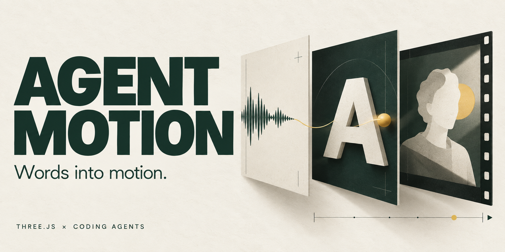
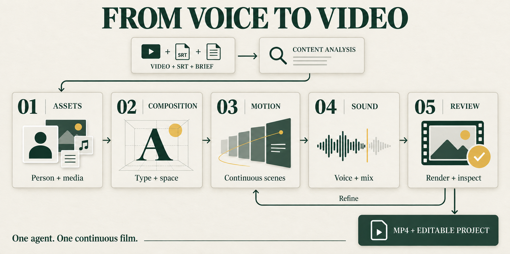
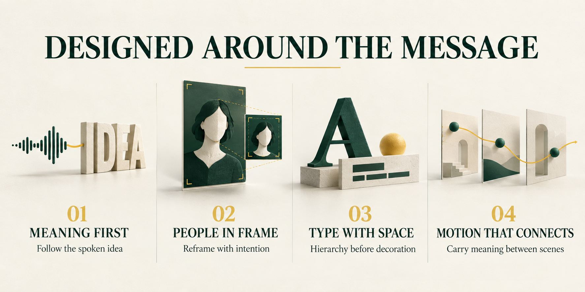

[English](README.md) · [简体中文](README.zh-CN.md) · [日本語](README.ja.md) · [Español](README.es.md) · [Français](README.fr.md)

[Démos](#demos) · [Processus](#workflow) · [Démarrer](#start)

**Votre voix. Des idées qui prennent forme.**

Confiez votre vidéo, le SRT complet et vos intentions à un agent. Agent Motion guide l’analyse, la mise en mouvement et la vérification jusqu’au **MP4 + projet Three.js modifiable**.

<sub>Usage non commercial. Tout usage commercial exige une autorisation écrite préalable. <a href="LICENSE">Licence ↗</a></sub>

<a id="demos"></a>

## Voir la différence

### 01 / Comprendre les espaces verts

**60 secondes · Source à gauche / résultat à droite.** Les temps source correspondent ; les visages sont suivis et floutés avec des contours progressifs des deux côtés. Aperçus muets.

<p align="center">
  
</p>

<p align="center"><strong><a href="docs/media/greening.mp4">Voir / télécharger le MP4 ↗</a></strong></p>

#### Deux autres façons de raconter

<details>

<summary><strong>02 / Entraînement hybride</strong> — Ouvrir la comparaison de 60 secondes</summary>

<p align="center">
  
</p>

<p align="center"><strong><a href="docs/media/hybrid-opening.mp4">Voir / télécharger le MP4 ↗</a></strong></p>

</details>

<details>

<summary><strong>03 / Communication scolaire</strong> — Ouvrir la comparaison de 60 secondes</summary>

<p align="center">
  
</p>

<p align="center"><strong><a href="docs/media/communication.mp4">Voir / télécharger le MP4 ↗</a></strong></p>

</details>

Trois films approuvés par l’auteur. Espaces verts et entraînement sont des sélections chronologiques avec les temps source ; communication scolaire est un passage continu. Ils ne valident pas toutes les révisions ultérieures des Skills. [Versions et portée des vérifications →](docs/demo-evidence.md)

<a id="workflow"></a>

## De la prise de parole au film



**Analyser → Préparer ressources et personne → Composer texte et espace → Animer → Mixer le son → Vérifier et corriger.**

L’agent lit chaque étape, réalise d’abord l’ouverture et le passage le plus difficile, puis développe le film avec une continuité d’auteur. Il préserve les temps de parole et inspecte la sortie réelle. L’installation et le lecteur d’étapes accompagnent ce travail ; ils ne génèrent pas un film seuls.

### Quatre principes de conception



- **Le sens d’abord** — Les actions visuelles expliquent la parole ; les preuves et les temps restent fidèles.
- **La personne dans l’espace** — Une couche synchronisée, de la profondeur et un cadrage précis. Contour uniquement si le fond original est remplacé.
- **Une typographie utile** — Comparer les polices dans de vraies compositions ; hiérarchiser et laisser le temps de lire.
- **Un mouvement continu** — Relier objets et attention d’une idée à l’autre. Vérifier un extrait continu avant d’étendre le film.

<a id="start"></a>

## Démarrer en local

Installez **Node.js 22+**, **Python 3.10+** et **FFmpeg/ffprobe** dans PATH. setup télécharge Chromium, sans appeler de service de génération payant. Ces commandes fonctionnent dans PowerShell et les shells POSIX.

```sh
git clone https://github.com/erduo1998-cell/agent-motion.git
cd agent-motion
npm ci
npm run setup
npm run doctor
npm test
npm run smoke
```

Placez la vidéo et le SRT complet dans `inputs/`, ouvrez le dépôt dans votre agent et demandez :

> Lis AGENTS.md et les deux Skills locaux. Crée un film à partir de inputs/source.mp4 et inputs/source.srt sans modifier l’ordre ni les temps de la parole. Travaille dans work/my-first-film/. Termine l’analyse, les ressources, la couche du présentateur, la typographie et l’espace, le mouvement continu, le son et la vérification réelle. Livre le MP4 et le projet modifiable. Réponds en français.

Lancez `npm run serve`, puis ouvrez la page créée par l’agent à `http://127.0.0.1:8793/work/my-first-film/`. La racine du serveur ne contient pas de film terminé.

### Votre agent, votre système

Codex, Claude Code, Gemini CLI, Cursor et GitHub Copilot disposent d’entrées vers les mêmes Skills locaux. Les autres agents peuvent lire `AGENTS.md`. **Aucune API propre à Codex n’est requise.** Il faut pouvoir utiliser fichiers, terminal, navigateur et inspection audiovisuelle.

**Windows · macOS · Ubuntu : chaîne de production vérifiée.** Les six tâches CI de 3 systèmes × Node 22/24 ont réussi installation, tests, préparation du paquet, diagnostic du navigateur et rendu réel Three.js → H.264. [CI ↗](https://github.com/erduo1998-cell/agent-motion/actions/runs/35433570433)

Cela vérifie les outils. Des films complets ont été produits avec Codex ; chaque autre client n’a pas encore fait l’objet d’une production indépendante de bout en bout. [Compatibilité et preuves →](docs/compatibility.md)

## Langues, références et permissions

Cinq README ; les Skills canoniques sont maintenus en chinois. Les agents multilingues peuvent travailler dans votre langue. Vérifiez polices, glyphes, retours et temps de lecture pour chaque langue. Le doublage automatique n’est pas inclus.

La bibliothèque publique contient **43 analyses, 109 intervalles de mécanismes et cinq groupes de méthodes pédagogiques**, uniquement en texte/JSON. Aucune vidéo source, piste audio, image extraite, miniature ou transcription complète n’est distribuée. Génération et détourage facultatifs dépendent de vos outils et licences. [Explorer les analyses →](reference-library/analysis/README.md)

Le code, les Skills, les documents et les analyses propres au projet utilisent **Motion Craft Community License 1.0**, une licence personnalisée fondée sur les clauses Apache-2.0 avec des restrictions non commerciales. Ce n’est pas Apache-2.0 standard. **Tout usage commercial exige une autorisation écrite préalable.** Polices et dépendances conservent leurs licences ; les médias de démonstration sont exclus de cette autorisation.

[Licence](LICENSE) · [Autorisation commerciale](COMMERCIAL-LICENSE.md) · [Mentions tierces](THIRD_PARTY_NOTICES.md)

---

[Architecture](docs/architecture.md) · [Contribuer](CONTRIBUTING.md) · [Préparation](docs/release-readiness.md)
