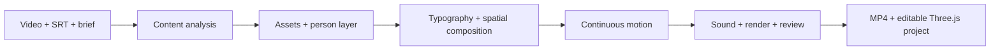

# Agent Motion · Three.js Talking-Head Video

[English](README.md) · [简体中文](README.zh-CN.md) · [日本語](README.ja.md) · [Español](README.es.md) · [Français](README.fr.md)

> **Noncommercial use only; commercial use requires prior written authorization.** [License](LICENSE) · [Reference analysis only—no reference videos](reference-library/analysis/README.md)

**Turn a talking-head recording and subtitles into an edited motion-design film—with a coding agent.**

Agent Motion guides an agent through content analysis, assets and person layers, typography, spatial composition, continuous animation, sound and final review. Scenes remain editable Three.js projects. Give it your source video, complete SRT, and a brief; the agent carries the production through to a rendered film.

## See the difference

Each **60-second** loop shows matching source times: original on the left, packaged film on the right. Faces on both sides are covered with opaque pixel mosaics. Hybrid training and greenery are chronological selections with source times labelled; teacher communication is continuous. These silent GIFs do not demonstrate the sound mix.


These are selected excerpts from three owner-approved films. Current rules include later refinements; these clips are not a full regression test of the latest Skills. [Versions, timing and test scope →](docs/demo-evidence.md)

## Start locally

Requirements: **Node.js 22+**, **Python 3.10+**, **FFmpeg and ffprobe** on PATH, and Chromium. Run from the downloaded repository directory. Setup downloads the Playwright browser; it does not call a paid generation service.

```sh
git clone https://github.com/erduo1998-cell/agent-motion.git
cd agent-motion
npm ci
npm run setup
npm run doctor
npm test
npm run smoke
```

Put your files in `inputs/`, then open this folder in your coding agent and send:

> Read AGENTS.md and the two project-local Skills. Create a complete talking-head film using inputs/source.mp4 and inputs/source.srt. Preserve the original speech order and timing. Work in work/my-first-film/. Complete the content analysis, assets/person layer, typography and spatial composition, continuous motion, sound and actual output review; deliver the MP4 and editable project. Respond in English.

To preview a task, run `npm run serve` and open the task page under `http://127.0.0.1:8793/work/my-first-film/`. The agent creates that page during production; there is no default completed film at the server root.

## Use your preferred agent

The workflow uses files, terminal commands, a browser and media inspection. **It has no required Codex API or Codex-only production step.** Codex, Claude Code, Gemini CLI, Cursor and GitHub Copilot receive entry instructions that point to the same local Skills. Other capable agents can read `AGENTS.md` explicitly.

| Host / platform | Support boundary |
| --- | --- |
| Codex | Project-local Skills and AGENTS entry; historical production examples |
| Claude Code / Gemini CLI | Dedicated entry files; same workflow and tools |
| Cursor / GitHub Copilot | Workspace instruction adapters; use an agent mode with command execution |
| Windows / macOS / Linux | Portable Node/Python tooling and three-OS CI configuration |

Adapters are supplied; this is not a claim that every model/client/OS combination has completed an identical end-to-end film. Native execution evidence and prerequisites are in [compatibility](docs/compatibility.md).

## How it works



Automation is performed by the agent following the Skills. The stage reader supplies complete instructions; it is not a universal video compiler. One continuous author owns the film, while the agent host can vary. Optional asset generation and matting tools depend on your available tools and licenses.

## Languages and scope

Five README languages are provided. The canonical production Skills are in Chinese; multilingual agents can follow them and respond in your language. Chinese/English typography is covered by the included references. Other languages need appropriate fonts, glyph checks, line breaks and reading time; there is no automatic dubbing or guaranteed universal-script layout.

[Architecture](docs/architecture.md) · [Compatibility](docs/compatibility.md) · [Contributing](CONTRIBUTING.md) · [Release readiness](docs/release-readiness.md)

Project-owned code, Skills, documentation and reference analysis use [Motion Craft Community License 1.0](LICENSE), derived from Apache-2.0 terms with noncommercial restrictions. **Commercial use requires prior written authorization**; see [commercial licensing](COMMERCIAL-LICENSE.md). This is a custom source-available license, not standard Apache-2.0. Fonts/dependencies retain their own licenses; Demo footage is separately excluded. [Third-party notices](THIRD_PARTY_NOTICES.md).
