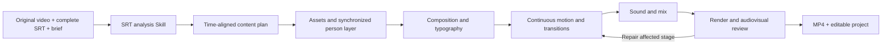

# Architecture / 项目结构

This is an agent-operated Three.js production workspace. The agent reads the complete SRT, develops the film, writes the scene and rendering code, and checks the result. The repository supplies the production rules, stage reader, framing/transition helpers and local runtime tools. It does not ship a universal command that turns every video into a finished film without an agent.

The five production stages belong to one continuous author. Multi-agent **host compatibility** means the same workflow can be operated by different coding assistants; it does not mean five agents independently assemble five incompatible pieces of one film.

| Path | Role |
| --- | --- |
| `AGENTS.md` | Routes tasks to the two project-local Skills |
| `.agents/skills/srt-reference-to-three/` | Complete SRT interpretation, timing and handoff |
| `.agents/skills/motion-craft/` | Assets, composition, motion, sound, review and mathematical helpers |
| `scripts/` | Cross-platform setup, diagnosis, reading and validation |
| `serve.mjs` | Local preview HTTP server |
| `reference-library/analysis/` | Published text/JSON study parameters and conclusions; no source videos or extracted images |
| `reference-library/typography/` | Reusable open fonts, licenses and original specimen sheets |
| `inputs/` | User inputs; ignored by Git |
| `work/<task>/` | Task-specific analysis, scene, assets and rendered outputs; ignored |
| `docs/media/` | Selected public-facing comparison excerpts |
| `skill-versions/` | Local historical snapshots; excluded from distribution |

Actual dependencies are Three.js, Playwright/Chromium, Python and FFmpeg. There is no SwayJS package or SwayJS service in the runtime. No Codex account, private knowledge system or fixed cloud-generation provider is required by the project code. Your chosen agent still needs its own runtime access and permissions.

## 当前制作基线

正式版基于原版 Motion Craft 的空间、人物取景与字体定向修订。Impeccable 融合实验及旧多 Agent 分段方案均未启用。现行规则区分抠像与描边：保留原背景不描人边，更换人物身后背景才描边；人物卡片需要可见空间层次和二次取景；字体需用真实构图比较。开源适配只解决安装、路径和宿主入口，不把历史实验重新引入。

Historical demos were rendered before some of these later corrections. They illustrate the workflow's output, not a regression proof for every current rule. See the [demo notes](demo-evidence.md).
